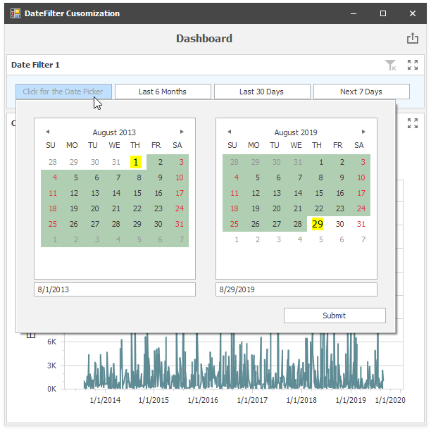

<!-- default file list -->
*Files to look at*:

* [Form1.cs](./CS/DateFilter_Customization/Form1.cs) (VB: [Form1.vb](./VB/DateFilter_Customization/Form1.vb))
<!-- default file list end -->

# Dashboard for WinForms - How to Customize the Date Filter Dashboard Item

This example demonstrates how to access the underlying controls to customize the [Date Filter](https://docs.devexpress.com/Dashboard/400675) dashboard item.

It changes the datepicker's caption, background color and paints selected dates and dates contained in the underlying data in a custom manner.

API in this example:

* [DashboardViewer.DashboardItemControlCreated](https://docs.devexpress.com/Dashboard/DevExpress.DashboardWin.DashboardViewer.DashboardItemControlCreated) event
* [DashboardViewer.DashboardItemControlUpdated](https://docs.devexpress.com/Dashboard/DevExpress.DashboardWin.DashboardViewer.DashboardItemControlUpdated) event
* [DashboardViewer.DashboardItemBeforeControlDisposed](https://docs.devexpress.com/Dashboard/DevExpress.DashboardWin.DashboardViewer.DashboardItemBeforeControlDisposed) event
* [DashboardItemControlEventArgs.DateFilterControl](https://docs.devexpress.com/Dashboard/DevExpress.DashboardWin.DashboardItemControlEventArgs.DateFilterControl) property
* [DateFilterControl](https://docs.devexpress.com/Dashboard/DevExpress.DashboardWin.DateFilterControl) class
* [DateFilterControl.CalendarFrom](https://docs.devexpress.com/Dashboard/DevExpress.DashboardWin.DateFilterControl.CalendarFrom) property
* [DateFilterControl.CalendarTo](https://docs.devexpress.com/Dashboard/DevExpress.DashboardWin.DateFilterControl.CalendarTo) property
* [CalendarControl](https://docs.devexpress.com/WindowsForms/DevExpress.XtraEditors.Controls.CalendarControl) class
* [CalendarControl.CustomDrawDayNumberCell](https://docs.devexpress.com/WindowsForms/DevExpress.XtraEditors.Controls.CalendarControlBase.CustomDrawDayNumberCell) event
* [DateFilterControl.CustomDisplayText](https://docs.devexpress.com/Dashboard/DevExpress.DashboardWin.DateFilterControl.CustomDisplayText) event
* [DashboardViewer.GetItemData](https://docs.devexpress.com/Dashboard/DevExpress.DashboardWin.DashboardViewer.GetItemData(System.String)) method
* [MultiDimensionalData](https://docs.devexpress.com/Dashboard/DevExpress.DashboardCommon.ViewerData.MultiDimensionalData) class
* [MultiDimensionalData.GetMeasures](https://docs.devexpress.com/Dashboard/DevExpress.DashboardCommon.ViewerData.MultiDimensionalData.GetMeasures) method

**See also:**

* [Access to Underlying Controls](https://docs.devexpress.com/Dashboard/18019)

## More Examples
- [How to Create a Dashboard with DateFilterDashboardItem in Code](https://github.com/DevExpress-Examples/winforms-dashboard-create-datefilterdashboarditem)
